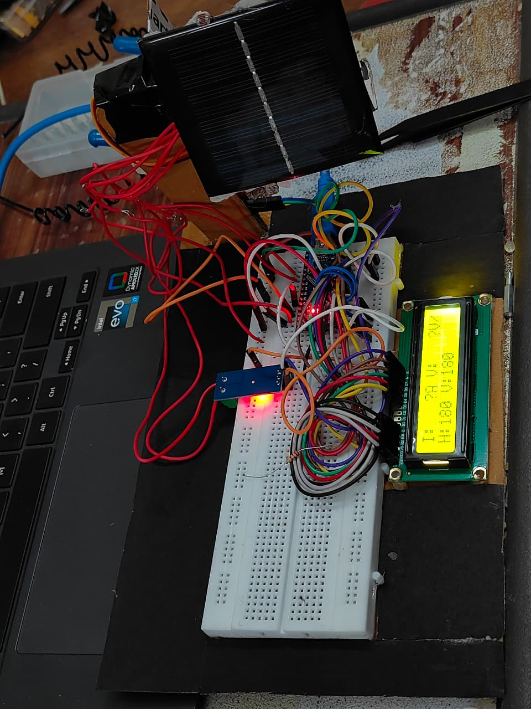
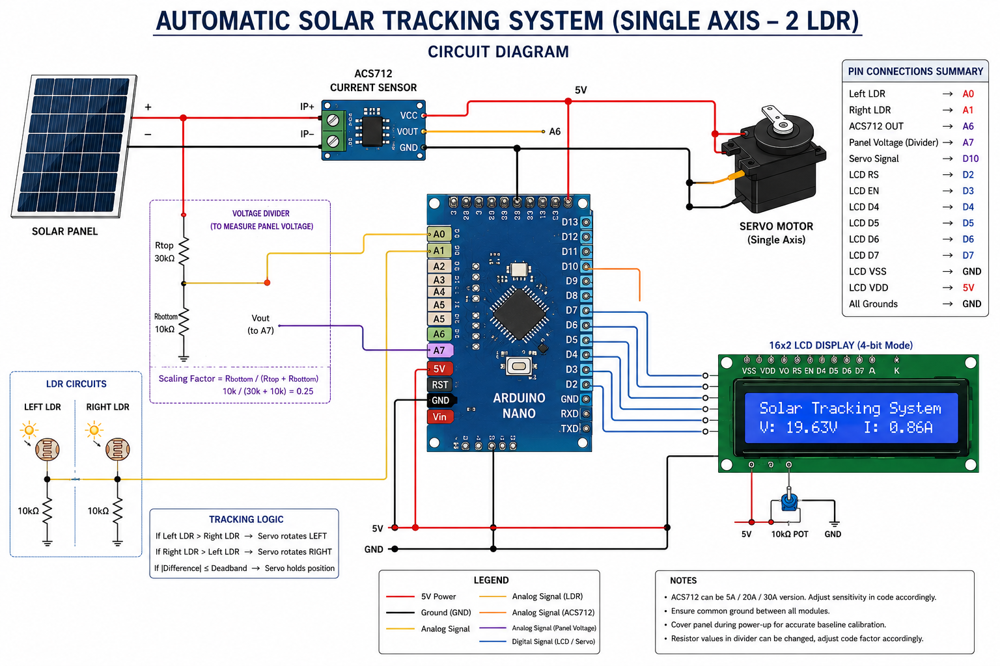

# Automatic Solar Tracking System

An Arduino-based **single-axis automatic solar tracking system** designed to improve solar energy capture by continuously adjusting the orientation of a solar panel according to the direction of maximum sunlight.

The system uses **two LDR sensors**, positioned on opposite sides of the solar panel, to detect differences in light intensity. An Arduino processes these readings and controls a servo motor to rotate the panel toward the brighter side.

The system also includes **solar-panel voltage and current monitoring** and a **16×2 LCD display** for real-time system information.

---

## Project Overview

Conventional fixed solar panels remain at a fixed orientation throughout the day. Since the Sun continuously changes its position, the angle of incident sunlight on the panel also changes, which can reduce the amount of solar energy captured.

This project addresses this limitation using a simple embedded control system. Two LDRs are placed on opposite sides of the panel with a small divider between them. When one LDR receives more light than the other, the Arduino determines the direction in which the panel needs to move and commands the servo motor accordingly.

The process continues throughout the day, allowing the panel to follow the apparent movement of the Sun along a single axis.

---

## Objectives

* Develop a low-cost automatic solar tracking system.
* Detect the direction of maximum sunlight using two LDR sensors.
* Automatically adjust the solar-panel orientation using a servo motor.
* Maintain the panel closer to the optimum angle of incidence.
* Monitor solar-panel voltage and current.
* Display real-time system parameters on a 16×2 LCD.
* Demonstrate the application of embedded systems and automation in renewable-energy systems.

---

## Working Principle

The system uses two LDR sensors placed on opposite sides of the solar panel.

```text
                SUNLIGHT
                   ↓
          ┌─────────────────┐
          │                 │
       LDR LEFT          LDR RIGHT
          │                 │
          └───────┬─────────┘
                  │
             Arduino
                  │
             Servo Motor
                  │
                  ▼
            Solar Panel
```

The Arduino continuously reads the analog values from both LDRs and compares them.

### Tracking Logic

```text
LDR Left > LDR Right
        ↓
Panel rotates toward the LEFT

LDR Right > LDR Left
        ↓
Panel rotates toward the RIGHT

Difference within deadband
        ↓
Panel is sufficiently aligned
        ↓
Servo remains stationary
```

A small **deadband** is used to prevent unnecessary servo movement caused by small fluctuations in the LDR readings.

---

## System Operation

The tracking process follows a feedback loop:

```text
      Sunlight
         ↓
     Two LDRs
         ↓
   Light Intensity
      Comparison
         ↓
   Arduino Decision
         ↓
     Servo Motor
         ↓
   Panel Movement
         ↓
  New LDR Readings
         │
         └───────────↺
```

The Arduino repeatedly measures the two LDR values and adjusts the servo whenever the difference between them exceeds the defined threshold.

---

<p align="center">
  <br/>
  <i>System Prototype</i>
</p>
---

## Hardware Components

| Component             | Quantity | Purpose                            |
| --------------------- | -------: | ---------------------------------- |
| Arduino               |        1 | Main controller                    |
| LDR                   |        2 | Detect relative sunlight intensity |
| Servo Motor           |        1 | Rotate the solar panel             |
| Solar Panel           |        1 | Generate electrical power          |
| 10 kΩ Resistors       |        2 | LDR voltage-divider circuits       |
| ACS712 Current Sensor |        1 | Measure panel current              |
| Voltage Divider       |        1 | Measure panel voltage              |
| 16×2 LCD              |        1 | Display system parameters          |
| Breadboard            |        1 | Prototype assembly                 |
| Jumper Wires          |        — | Electrical connections             |

---

## Hardware Architecture

```text
                    ┌─────────────────┐
                    │   SOLAR PANEL   │
                    └────────┬────────┘
                             │
                   ┌─────────┴─────────┐
                   │                   │
              Voltage Divider       ACS712
                   │                   │
                   ▼                   ▼
              Arduino ADC          Arduino ADC
                   │                   │
                   └─────────┬─────────┘
                             │
        ┌────────────────────┴────────────────────┐
        │                 ARDUINO                 │
        │                                         │
        │     LDR Left ──┐                        │
        │                 ├── Light Comparison   │
        │     LDR Right ─┘                        │
        │                                         │
        │                 │                       │
        │                 ▼                       │
        │            Servo Control                │
        └─────────────────┬───────────────────────┘
                          │
                          ▼
                   SERVO MOTOR
                          │
                          ▼
                    PANEL ROTATION

                          │
                          ▼
                     16×2 LCD
```

---

## Sensor Processing

The two LDRs generate analog readings corresponding to the light intensity received from their respective sides.

The Arduino calculates the difference:

```text
ΔL = LDR_Left − LDR_Right
```

The tracking decision is based on this difference.

If the difference is larger than the defined deadband, the servo rotates the panel toward the side receiving greater illumination.

A deadband prevents continuous oscillation when both LDRs receive nearly equal light.

---

## Solar Panel Monitoring

### Current Measurement

An **ACS712 current sensor** is used to monitor the current generated by the solar panel.

The measured current can be calculated from the sensor output using:

```text
I = (Vout − Vzero) / Sensitivity
```

The sensor's zero-current offset can be calibrated during system startup.

### Voltage Measurement

The solar-panel voltage is measured through a resistor-divider circuit before being supplied to the Arduino's analog input.

The voltage-divider allows the Arduino to measure a panel voltage higher than its direct ADC input range.

---

## LCD Monitoring

The 16×2 LCD provides real-time information about the system.

Depending on the operating condition, the display can be used to show:

* Solar-panel current
* Solar-panel voltage
* Servo position
* System status
* Light-detection events

---

## Control Algorithm

```text
START
  │
  ▼
Initialize Arduino
  │
  ▼
Initialize LDRs, Servo,
LCD and Monitoring Sensors
  │
  ▼
Read Left LDR
  │
  ▼
Read Right LDR
  │
  ▼
Calculate Light Difference
  │
  ▼
Is Difference > Deadband?
       │
   ┌───┴───┐
   │       │
  YES      NO
   │       │
   ▼       ▼
Determine  Keep Servo
Direction  Stationary
   │
   ▼
Move Servo
Toward Brighter Side
   │
   ▼
Read Panel Voltage
and Current
   │
   ▼
Update LCD
   │
   └──────────────↺
```
---
<p align="center">
  <br/>
  <i>Circuit Diagram</i>
</p>

---

## Testing and Observations

The implemented system was tested by changing the direction and intensity of light falling on the two LDR sensors.

Observed operation includes:

* Servo movement toward the side receiving greater light intensity.
* Stable positioning when both LDRs receive approximately equal illumination.
* Automatic panel repositioning when the light source changes direction.
* Real-time monitoring of electrical parameters through the LCD.
* Stable sensor operation using filtering and appropriate thresholding.
* Successful operation of the prototype under controlled lighting conditions.

---

## Software

The project is programmed using the **Arduino IDE**.


## Code
```
#include <Servo.h>
#include <LiquidCrystal.h>
#include <math.h>

// ---------------- LCD ----------------
// RS, EN, D4, D5, D6, D7
LiquidCrystal lcd(2, 3, 4, 5, 6, 7);

// ---------------- Single-axis tracker ----------------
Servo trackerServo;

const int pinServo = 10;       // Servo signal -> D10
const int ldrLeftPin = A0;     // Left LDR divider midpoint -> A0
const int ldrRightPin = A1;    // Right LDR divider midpoint -> A1

int servoPos = 90;
const int servoLimitLow = 5;
const int servoLimitHigh = 180;
const int servoStep = 2;

const float alpha = 0.25f;     // EMA smoothing
const int deadband = 6;
const int moveDelay = 10;

float filteredLeft = 0.0f;
float filteredRight = 0.0f;

// ---------------- ACS712 current sensor ----------------
const int currentSensorPin = A6;   // ACS712 OUT -> A6
float ACS_SENSITIVITY = 0.185f;    // 5 A module; change if using 20 A/30 A version
const float VREF = 5.0f;
const int ADC_MAX = 1023;
int invertSign = 1;

const int CAL_SAMPLES = 200;
const int CURRENT_SAMPLES = 12;
float zeroADC = 512.0f;

// ---------------- Panel voltage divider ----------------
// Solar panel + -> 30 kOhm -> A7 -> 10 kOhm -> GND
const int panelPin = A7;
const float Rtop = 30000.0f;
const float Rbottom = 10000.0f;
const float DIV_FACTOR = Rbottom / (Rtop + Rbottom);

const int OVERSAMPLE_COUNT = 64;

// ---------------- LCD timing ----------------
unsigned long lastLCD = 0;
const unsigned long LCD_INTERVAL = 400;

int clampServo(int value) {
  if (value < servoLimitLow) return servoLimitLow;
  if (value > servoLimitHigh) return servoLimitHigh;
  return value;
}

float readPanelVoltage() {
  long total = 0;
  for (int i = 0; i < OVERSAMPLE_COUNT; ++i) {
    total += analogRead(panelPin);
    delayMicroseconds(50);
  }

  float avgADC = (float)total / OVERSAMPLE_COUNT;
  float vAdc = (avgADC / ADC_MAX) * VREF;
  return vAdc / DIV_FACTOR;
}

float readCurrentAmps() {
  long total = 0;

  for (int i = 0; i < CURRENT_SAMPLES; ++i) {
    total += analogRead(currentSensorPin);
    delay(2);
  }

  float avgADC = (float)total / CURRENT_SAMPLES;
  float vOut = (avgADC / ADC_MAX) * VREF;
  float vZero = (zeroADC / ADC_MAX) * VREF;

  return invertSign * ((vOut - vZero) / ACS_SENSITIVITY);
}

void setup() {
  Serial.begin(115200);

  lcd.begin(16, 2);
  lcd.print("Tracker start");

  trackerServo.attach(pinServo);
  servoPos = clampServo(servoPos);
  trackerServo.write(servoPos);

  filteredLeft = analogRead(ldrLeftPin);
  filteredRight = analogRead(ldrRightPin);

  // ACS712 zero-current calibration.
  // Ensure no current is flowing through the sensor during startup calibration.
  long total = 0;
  for (int i = 0; i < CAL_SAMPLES; ++i) {
    total += analogRead(currentSensorPin);
    delay(5);
  }
  zeroADC = (float)total / CAL_SAMPLES;

  delay(700);
  lcd.clear();
}

void loop() {
  // ---------- Read and filter LDRs ----------
  int rawLeft = analogRead(ldrLeftPin);
  int rawRight = analogRead(ldrRightPin);

  filteredLeft =
      alpha * rawLeft + (1.0f - alpha) * filteredLeft;
  filteredRight =
      alpha * rawRight + (1.0f - alpha) * filteredRight;

  float lightError = filteredLeft - filteredRight;

  // ---------- Single-axis tracking ----------
  if (abs(lightError) > deadband) {
    if (lightError > 0) {
      servoPos -= servoStep;
    } else {
      servoPos += servoStep;
    }

    servoPos = clampServo(servoPos);
    trackerServo.write(servoPos);
  }

  // ---------- Electrical monitoring ----------
  float currentAmps = readCurrentAmps();
  float panelVoltage = readPanelVoltage();

  // ---------- LCD ----------
  unsigned long now = millis();

  if (now - lastLCD >= LCD_INTERVAL) {
    lastLCD = now;

    lcd.setCursor(0, 0);
    lcd.print("V:");
    lcd.print(panelVoltage, 2);
    lcd.print(" I:");
    lcd.print(currentAmps, 2);
    lcd.print(" ");

    lcd.setCursor(0, 1);
    lcd.print("L:");
    lcd.print((int)filteredLeft);
    lcd.print(" R:");
    lcd.print((int)filteredRight);
    lcd.print(" ");

    Serial.print("Left:");
    Serial.print(filteredLeft);
    Serial.print(" Right:");
    Serial.print(filteredRight);
    Serial.print(" Error:");
    Serial.print(lightError);
    Serial.print(" Servo:");
    Serial.print(servoPos);
    Serial.print(" V:");
    Serial.print(panelVoltage, 3);
    Serial.print(" I:");
    Serial.println(currentAmps, 3);
  }

  delay(moveDelay);
}

### Main Arduino Libraries

```cpp
#include <Servo.h>
#include <LiquidCrystal.h>
#include <math.h>
```

---

## Future Scope

The current prototype can be further improved through:

* IoT-based remote monitoring
* Cloud-based solar-energy data logging
* Real-time performance dashboards
* AI/ML-based solar optimization
* Automatic fault detection
* Improved energy-storage integration
* Higher-power solar-panel implementation
* More precise tracking mechanisms
* Integration with smart-grid systems

---

## Applications

The system can be adapted for:

* Small-scale photovoltaic systems
* Educational renewable-energy projects
* Embedded-system demonstrations
* Automated solar-energy harvesting
* Smart solar installations
* Remote renewable-energy systems

---

## Project Benefits

* **Automatic:** Requires minimal manual intervention.
* **Low Cost:** Uses commonly available electronic components.
* **Energy Efficient:** Continuously adjusts the panel orientation according to sunlight direction.
* **Embedded Control:** Demonstrates sensor interfacing and microcontroller-based decision making.
* **Scalable:** The concept can be extended to larger solar installations.
* **Renewable:** Supports improved utilization of solar energy.

---


## License

This project is developed for **educational and academic purposes**.

You are free to study, modify, and extend the project for learning and research.

## Author

Piyush Samuel M, Pragati Verma
